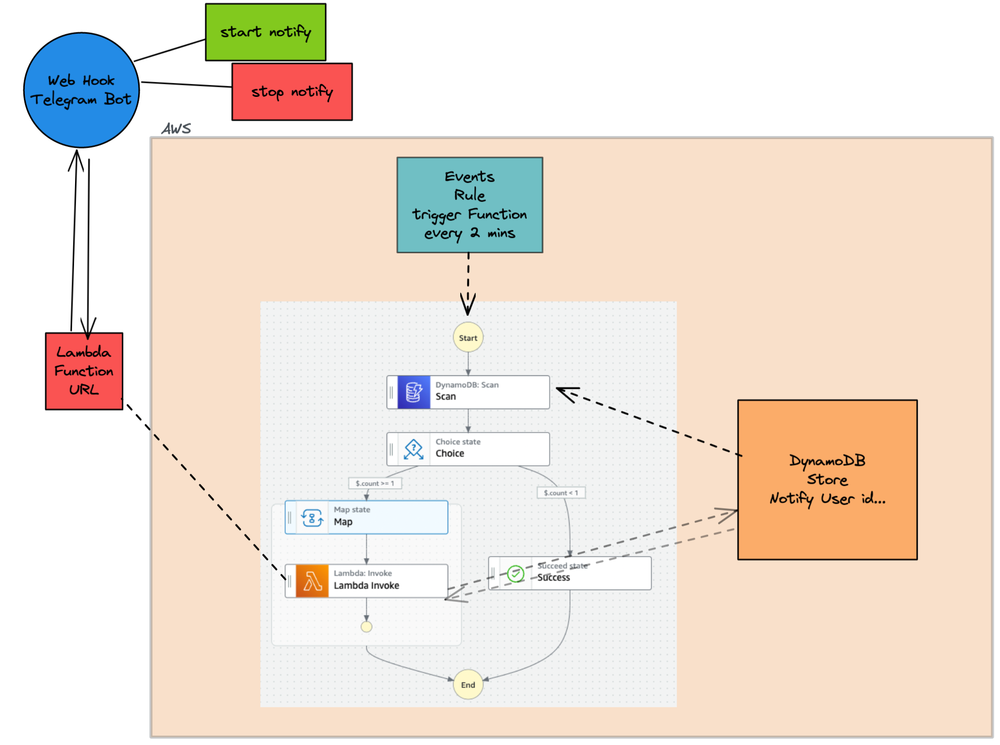

# Stepn Notify bot


## Init
- Create a telegram bot from `botFather`, and get the `HTTP_TOKEN`(TELEGRAM_NOTIFY).


- export `TELEGRAM_NOTIFY` in your shell.
```bash
export TELEGRAM_NOTIFY=1234456789:xxxxxxxxxxxxxxxxxxxxxxxxxxxx
```


## To Install
```bash
yarn
```

## To testing
```bash
yarn test
```

## To deploy
```bash
npx cdk deploy
```


## Setting Telegram Bot webhook
```bash
curl \
"https://api.telegram.org/bot${TELEGRAM_NOTIFY}/setWebhook?url=${Lambda_Function_URL}"
---
{"ok":true,"result":true,"description":"Webhook was set"}
```


## To destroy
```bash
npx cdk destroy
```